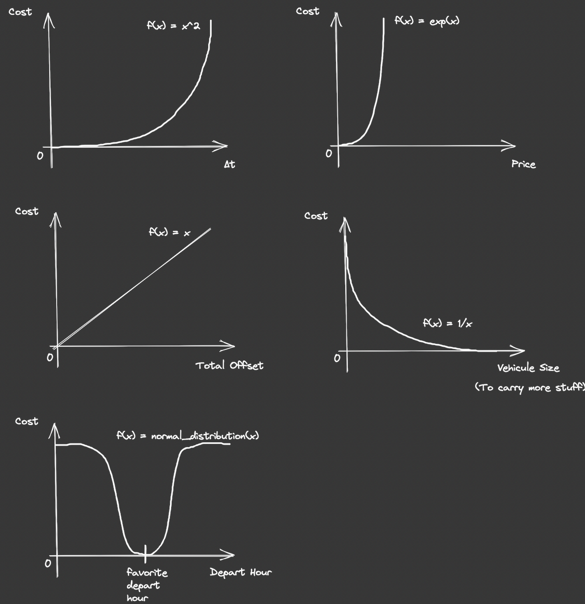
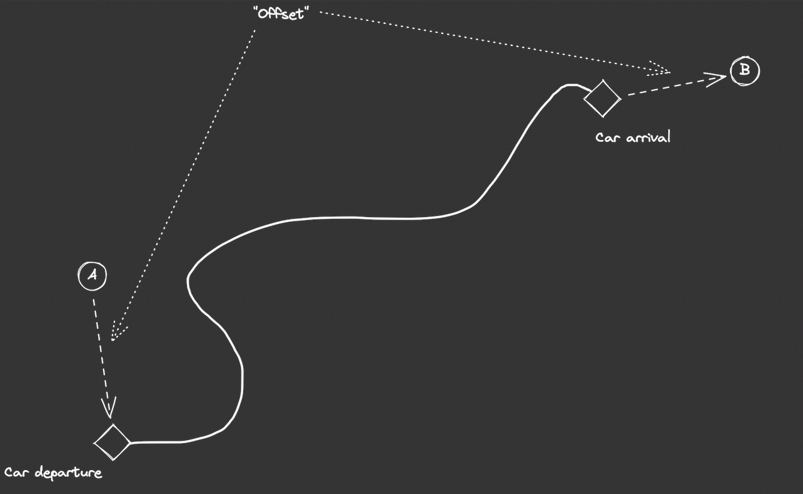

# BlaBlaCar Weekly Bot

Find the best trip while doing something else

## 🤨 Why

Because I am lazy and I lose some time each week searching for a trip that:

- isn't too far from my home
- leaves in the evening
- has at least a medium trunk to carry my luggage
- doesn't cost too much
- is fast

## ⚙️ How

### 🤖 The bot process

The bot can run mutiple times (e.g. once or twice) a day for a week. This makes less than 60 API calls a month.
**️⚠️ caching for more than 24h is prohibited by the BlaBlaCar API's terms of use. See step 5. of section [💻 Usage](#usage)**

It sends an email to myself so that my phone can catch it and automatically text the driver.


### 🧠 The decision process

Each trip has a cost: the higher the cost, the lower the fitness. The trip with the best fitness is the best one.

The fitness is calculated thanks to decision curves that are only relevant to me here.



The _total offset_ can be seen as the total amount of walking that I'll do.
Note that it is unprecise because it calculates the distance as the crow flies (with earth spherical radius approximation) and doesn't take roads into acount. That's why I thought that a linear function was better/smoother for this one.



## 💻 Usage

The bot needs a working BlaBlaCar API key, libcurl installed and a gmail account

1. **remove `.example` file extension from files in root project directory**

| before                       | after                |
| ---------------------------- | -------------------- |
| `api_key.txt.example`        | `api_key.txt`        |
| `home_waypoints.cfg.example` | `home_waypoints.cfg` |
| `credentials.txt.example`    | `credientials.txt`   |

2. **replace the line with your api key in `api_key.txt`**

```txt
<your api key here>
```

3. **put the departure and destination coordinates in `home_waypoints.cfg`**

```txt
WAYPOINT_HOME_SRC_LAT=47.28924920038468
WAYPOINT_HOME_SRC_LONG=-1.5238583838444812
WAYPOINT_HOME_DEST_LAT=47.381717002605534
WAYPOINT_HOME_DEST_LONG=0.6817963842370788
```

4. **add gmail credentials**
   - create an _application password_ in gmail
   - update username and password in `credentials.txt` with the previous application key

```txt
johndoe@gmail.com
dkfjlqqqkdjfhhtl
```

5. **update constants**

- departure date in `./src/api_caller.h`

```c
#define DEPARTURE_DATE "2022-02-04"
```

- target depart hour in `./src/trip.h`

```c
#define TARGET_HOUR 19 /* [0, 24] */
```

- bot sleep interval in `./src/bot.h`

```c
#define BOT_SLEEP_INTERVAL_SEC 86400 /* 24 hours */
```

6. **compile**

```bash
make
```

7. **run**

```bash
./bbcbot
```

The bot will run until next sunday.

8. **(Optional) protect your credentials**

Your _api key_ and _gmail password_ are stored in plain text files. If you want to protect yourself from someone that may get access to these files you can restrict to `root` user.

```bash
$ chmod 400 api_key.txt
$ chmod 400 credentials.txt
$ sudo chown root api_key.txt
$ sudo chown root credentials.txt
```

Note that this requires the program to be launched as `root` and since it runs in the background, you do this at your own risks.

```bash
$ sudo ./bbcbot
```

## 📚 Dependencies

| Name                 | Link                                                                                   |
| -------------------- | -------------------------------------------------------------------------------------- |
| `cJSON`              | https://github.com/DaveGamble/cJSON                                                    |
| `libcurl`            | https://github.com/curl/curl                                                           |
| `BlaBlaCar API`      | https://support.blablacar.com/hc/en-gb/categories/360002585239-Developer-BlaBlaCar-API |
| `Gmail smtps server` | https://support.google.com/a/answer/176600?hl=en#zippy=                                |

## 🤒 Technology

This bot is mainly written in C which happened to be a very bad choice. I took it to improve my C skills and practice writing cleaner code

Consider rewriting it in a language that makes sense like Python.
